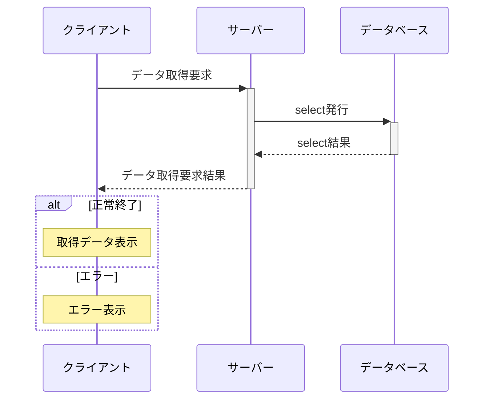

# ang-simple-twitter
angular simple twitter client

# requirement
node 12

# install
<pre>
 `git clone https://github.com/hideume/ang-simple-twitter
 cd ang-simple-twitter
 npm install`

set systemenvironment
 Twitter_CONSUMER_KEY,
 Twitter_CONSUMER_SECRET,
 Twitter_ACCESS_TOKEN_KEY,
 Twitter_ACCESS_TOKEN_SECRET

node server.js
ng s
</pre>

#update
* 11/6 add limit
* 11/20 add users
* 11/23 icon change
* 11/24 retweet
* 11/29 search